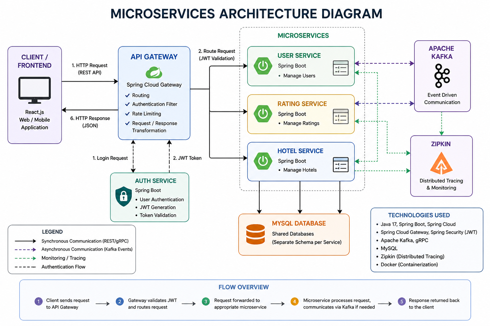

# 🚀 Microservices Backend System (Spring Boot)

A scalable microservices-based backend system built using **Java, Spring Boot, and modern distributed architecture patterns**. This project demonstrates real-world backend engineering concepts including API Gateway, authentication, event-driven communication, and observability.

---

## 📌 Overview

This system simulates a backend platform where multiple services communicate with each other to handle user data, ratings, and business operations.

It is designed to showcase:
- Microservices architecture
- Secure authentication (JWT)
- Inter-service communication (REST + gRPC)
- Event-driven workflows (Kafka)
- Distributed tracing and monitoring

---

## 🏗️ Architecture

- **API Gateway** – Single entry point for all client requests  
- **Auth Service** – Handles authentication and JWT token generation/validation  
- **User Service** – Manages user data  
- **Rating Service** – Handles user ratings  
- **Hotel Service** – Provides hotel-related data  
- **Kafka** – Event-driven communication between services  
- **gRPC** – High-performance service-to-service communication  
- **Zipkin** – Distributed tracing  

## 🏗️ Architecture Diagram

recommended)*

---

## ⚙️ Tech Stack

- **Backend:** Java, Spring Boot, Spring Security  
- **Architecture:** Microservices, API Gateway  
- **Communication:** REST APIs, gRPC, Kafka  
- **Database:** MySQL  
- **Security:** JWT Authentication  
- **Observability:** Zipkin, Logs  
- **Build Tool:** Maven  

---

## 🔐 Key Features

- Secure authentication using JWT  
- API Gateway routing and filtering  
- Event-driven communication with Kafka  
- gRPC for efficient internal communication  
- Distributed tracing using Zipkin  
- Clean architecture (Controller → Service → Repository)  

---

## 🚀 Getting Started

### Prerequisites

- Java 17+  
- Maven  
- MySQL  
- Kafka & Zookeeper  
- Zipkin (optional for tracing)  

---

### 🔧 Run the Project

1. Clone the repository:
   ```bash
   git clone https://github.com/awais0099/microservicesproject1.git
   cd microservicesproject1
